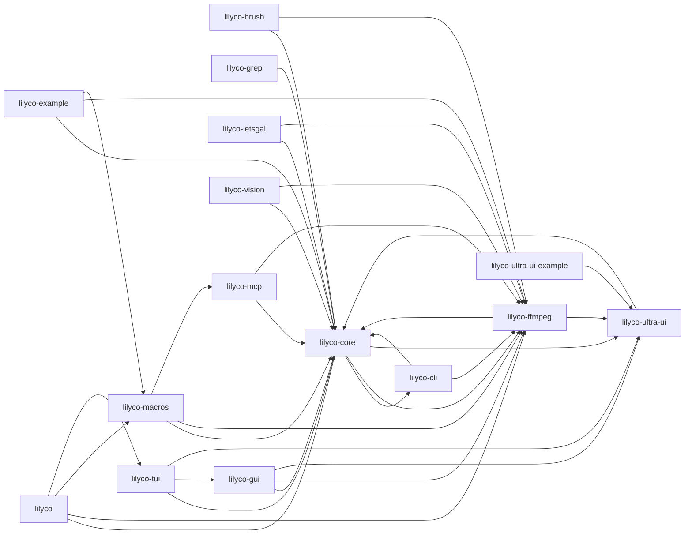

# lilyco 知识图谱 (codegraph)

> 由 Sourcegraph CodeGraph v1.5 索引 **967 节点 / 3612 边** → 自动生成 Obsidian 笔记
> 数据源: `lilyco/.codegraph/codegraph.db` · 生成器: `tools/export-lilyco-graph.py`

## 模块地图

| crate | 符号 | 函数/方法 | 结构体 | Trait | 依赖数 | 页面 |
|---|---|---|---|---|---|---|
| lilyco | 23 | 20 | 1 | 0 | 4 | [[lilyco-knowledge]] |
| lilyco-brush | 20 | 19 | 1 | 0 | 2 | [[lilyco-brush-knowledge]] |
| lilyco-cli | 37 | 36 | 0 | 0 | 2 | [[lilyco-cli-knowledge]] |
| lilyco-core | 109 | 91 | 7 | 3 | 3 | [[lilyco-core-knowledge]] |
| lilyco-example | 25 | 20 | 3 | 0 | 3 | [[lilyco-example-knowledge]] |
| lilyco-ffmpeg | 34 | 28 | 3 | 0 | 2 | [[lilyco-ffmpeg-knowledge]] |
| lilyco-grep | 13 | 11 | 2 | 0 | 1 | [[lilyco-grep-knowledge]] |
| lilyco-gui | 87 | 80 | 3 | 0 | 3 | [[lilyco-gui-knowledge]] |
| lilyco-letsgal | 37 | 33 | 2 | 0 | 2 | [[lilyco-letsgal-knowledge]] |
| lilyco-macros | 36 | 25 | 9 | 0 | 3 | [[lilyco-macros-knowledge]] |
| lilyco-mcp | 24 | 23 | 1 | 0 | 2 | [[lilyco-mcp-knowledge]] |
| lilyco-tui | 61 | 55 | 3 | 0 | 3 | [[lilyco-tui-knowledge]] |
| lilyco-ultra-ui | 53 | 42 | 3 | 0 | 1 | [[lilyco-ultra-ui-knowledge]] |
| lilyco-ultra-ui-example | 1 | 1 | 0 | 0 | 1 | [[lilyco-ultra-ui-example-knowledge]] |
| lilyco-vision | 71 | 62 | 9 | 0 | 2 | [[lilyco-vision-knowledge]] |

## 总体依赖 (crate 级 Mermaid)

## 边语义

| kind | 含义 | 数量 |
|---|---|---|
| `calls` | 调用 | 1844 |
| `contains` | 包含 | 1012 |
| `references` | 引用 | 528 |
| `instantiates` | 实例化 | 114 |
| `imports` | 导入 | 113 |
| `implements` | 实现 | 1 |
