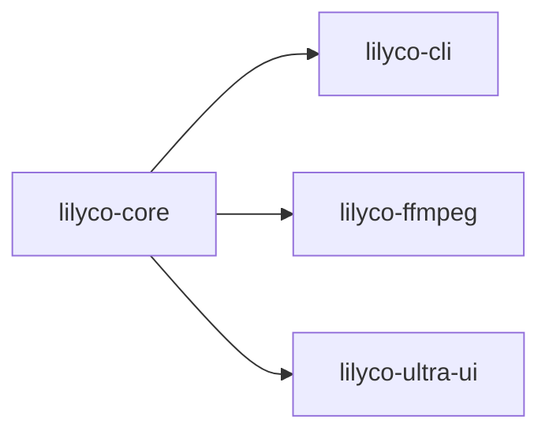

# lilyco · lilyco-core

> Sourcegraph CodeGraph 自动提取 · 观察即可,勿手改
> 再生成:`python tools/export-lilyco-graph.py`

## 概览

| 函数/方法 | 结构体 | 枚举/别名 | Trait | 路由 | 文件 |
|:--:|:--:|:--:|:--:|:--:|:--:|
| 91 | 7 | 8 | 3 | 0 | 8 |

## crate 依赖

## 公共符号 (public)

- 🧱 **`ArgSchema`** — 结构体 · `schema.rs:5`
- 🧱 **`CommandSchema`** — 结构体 · `schema.rs:38`
- 🧱 **`Context`** — 结构体 · `context.rs:11`
- 🧱 **`RegisteredCommand`** — 结构体 · `registry.rs:30`
- 🧱 **`Registry`** — 结构体 · `registry.rs:136`
- 🧱 **`RunOutcome`** — 结构体 · `executor.rs:69`
- 🧱 **`Task`** — 结构体 · `executor.rs:20`
- 🔠 **`AppError`** — 枚举 · `error.rs:8`
- 🔠 **`ArgKind`** — 枚举 · `schema.rs:19`
- 🔠 **`LogLevel`** — 枚举 · `progress.rs:52`
- 🔠 **`OutputFormat`** — 枚举 · `context.rs:26`
- 🔠 **`Progress`** — 枚举 · `progress.rs:10`
- 🔠 **`RegistryError`** — 枚举 · `registry.rs:116`
- ⚙️ **`execute`** — 函数 · `executor.rs:92` `(handler: Handler, args: serde_json::Value) -> RunOutcome`
- ⚙️ **`spawn`** — 函数 · `executor.rs:35` `(handler: Handler, args: serde_json::Value) -> Task`
- 🔧 **`alias`** — 方法 · `registry.rs:77` `(mut self, alias: impl Into<String>) -> Self`
- 🔧 **`contains`** — 方法 · `registry.rs:170` `(&self, name: &str) -> bool`
- 🔧 **`done`** — 方法 · `context.rs:100` `(&self, result: serde_json::Value, duration_ms: u64)`
- 🔧 **`emit`** — 方法 · `context.rs:71` `(&self, progress: Progress)`
- 🔧 **`error`** — 方法 · `context.rs:109` `(&self, code: i32, message: impl Into<String>)`
- 🔧 **`from_app`** — 方法 · `registry.rs:92` `() -> Self`
- 🔧 **`from_sender`** — 方法 · `context.rs:61` `(progress_tx: Sender<Progress>) -> Self`
- 🔧 **`get`** — 方法 · `registry.rs:163` `(&self, name: &str) -> Option<&RegisteredCommand>`
- 🔧 **`has_terminal`** — 方法 · `context.rs:119` `(&self) -> bool`
- 🔧 **`hidden`** — 方法 · `registry.rs:83` `(mut self, hidden: bool) -> Self`
- 🔧 **`into_result`** — 方法 · `executor.rs:78` `(self) -> Result<serde_json::Value, AppError>`
- 🔧 **`is_cancelled`** — 方法 · `context.rs:76` `(&self) -> bool`
- 🔧 **`iter`** — 方法 · `registry.rs:175` `(&self) -> impl Iterator<Item = &RegisteredCommand>`
- 🔧 **`last_event`** — 方法 · `executor.rs:83` `(&self) -> Option<&Progress>`
- 🔧 **`log`** — 方法 · `context.rs:92` `(&self, level: LogLevel, message: impl Into<String>)`
- 🔧 **`names`** — 方法 · `registry.rs:185` `(&self) -> Vec<String>`
- 🔧 **`new`** — 方法 · `context.rs:37` `(
        progress_tx: Sender<Progress>,
        cancel: Arc<AtomicBool>,
        output_format: OutputFormat,
    ) -> Self`
- 🔧 **`new`** — 方法 · `registry.rs:60` `(name: impl Into<String>, schema: CommandSchema) -> Self`
- 🔧 **`new`** — 方法 · `registry.rs:143` `() -> Self`
- 🔧 **`new_test`** — 方法 · `context.rs:51` `(tx: Sender<Progress>) -> Self`
- 🔧 **`register`** — 方法 · `registry.rs:148` `(&mut self, cmd: RegisteredCommand) -> Result<(), RegistryError>`
- 🔧 **`register_from_json`** — 方法 · `registry.rs:194` `(&mut self, json: &str) -> Result<(), RegistryError>`
- 🔧 **`tick`** — 方法 · `context.rs:81` `(&self, current: u64, total: Option<u64>, message: impl Into<String>)`
- 🔧 **`to_anthropic_tool`** — 方法 · `schema.rs:83` `(&self) -> serde_json::Value`
- 🔧 **`to_json`** — 方法 · `registry.rs:203` `(&self) -> serde_json::Value`
- 🔧 **`to_json_schema`** — 方法 · `schema.rs:47` `(&self) -> serde_json::Value`
- 🔧 **`to_openai_tool`** — 方法 · `schema.rs:71` `(&self) -> serde_json::Value`
- 🔧 **`visible`** — 方法 · `registry.rs:180` `(&self) -> impl Iterator<Item = &RegisteredCommand>`
- 🔧 **`with_handler`** — 方法 · `registry.rs:71` `(mut self, handler: Handler) -> Self`

## 调用关系 (top)

- **`run_brush`** → `read_with_cap`(×2), `resolve_shell`(×1), `build_path_env`(×1), `emit`(×1), `new`(×1), `done`(×1)
- **`resolve_shell`** → `find_on_path`(×2)
- **`resolve_git_usr_bin`** → `iter`(×1)
- **`path_entries`** → `path_sep`(×1)
- **`build_path_env`** → `resolve_git_usr_bin`(×1), `path_entries`(×1)
- **`find_on_path`** → `path_entries`(×1), `path_exts`(×1)
- **`run`** → `as_str`(×5), `done`(×5), `emit`(×2), `init_project`(×2), `validate_project`(×2), `new_test`(×1)
- **`shell_available`** → `resolve_shell`(×1)
- **`echo_runs_and_captures_stdout`** → `shell_available`(×1), `run`(×1)
- **`exit_code_is_propagated_not_errored`** → `shell_available`(×1), `run`(×1)
- **`stderr_is_captured`** → `shell_available`(×1), `run`(×1)
- **`cwd_is_honored`** → `shell_available`(×1), `run`(×1)

## 文件清单

- `lilyco-core/src/app.rs`
- `lilyco-core/src/context.rs`
- `lilyco-core/src/error.rs`
- `lilyco-core/src/executor.rs`
- `lilyco-core/src/lib.rs`
- `lilyco-core/src/progress.rs`
- `lilyco-core/src/registry.rs`
- `lilyco-core/src/schema.rs`

---
[[lilyco-core-knowledge|lilyco-core 知识图谱]] · [[lilyco-knowledge|← lilyco]] · [[lilyco-brush-knowledge|← lilyco-brush]] · [[lilyco-cli-knowledge|← lilyco-cli]] · [[lilyco-example-knowledge|← lilyco-example]] · [[lilyco-ffmpeg-knowledge|← lilyco-ffmpeg]] · [[lilyco-grep-knowledge|← lilyco-grep]] · [[lilyco-gui-knowledge|← lilyco-gui]] · [[lilyco-letsgal-knowledge|← lilyco-letsgal]] · [[lilyco-macros-knowledge|← lilyco-macros]] · [[lilyco-mcp-knowledge|← lilyco-mcp]] · [[lilyco-tui-knowledge|← lilyco-tui]] · [[lilyco-ultra-ui-knowledge|← lilyco-ultra-ui]] · [[lilyco-vision-knowledge|← lilyco-vision]]
