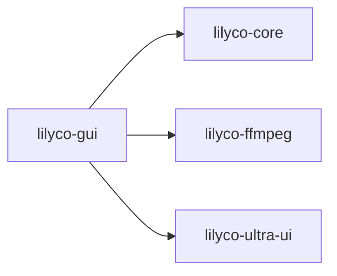

# lilyco · lilyco-gui

> Sourcegraph CodeGraph 自动提取 · 观察即可,勿手改
> 再生成:`python tools/export-lilyco-graph.py`

## 概览

| 函数/方法 | 结构体 | 枚举/别名 | Trait | 路由 | 文件 |
|:--:|:--:|:--:|:--:|:--:|:--:|
| 80 | 3 | 1 | 0 | 3 | 2 |

## crate 依赖

## 公共符号 (public)

- 🧱 **`GuiRenderer`** — 结构体 · `lib.rs:79`
- 🔧 **`new`** — 方法 · `lib.rs:95` `(port: u16) -> Self`
- 🔧 **`serve`** — 方法 · `lib.rs:99` `(&self, schema: CommandSchema, runner: RunnerFn)`
- 🔧 **`serve_app`** — 方法 · `lib.rs:138` `(&self, schema: CommandSchema)`

## 调用关系 (top)

- **`run_brush`** → `read_with_cap`(×2), `resolve_shell`(×1), `build_path_env`(×1), `emit`(×1), `new`(×1), `done`(×1)
- **`resolve_shell`** → `find_on_path`(×2)
- **`resolve_git_usr_bin`** → `iter`(×1)
- **`path_entries`** → `path_sep`(×1)
- **`build_path_env`** → `resolve_git_usr_bin`(×1), `path_entries`(×1)
- **`find_on_path`** → `path_entries`(×1), `path_exts`(×1)
- **`run`** → `as_str`(×5), `done`(×5), `emit`(×2), `init_project`(×2), `validate_project`(×2), `new_test`(×1)
- **`shell_available`** → `resolve_shell`(×1)
- **`echo_runs_and_captures_stdout`** → `shell_available`(×1), `run`(×1)
- **`exit_code_is_propagated_not_errored`** → `shell_available`(×1), `run`(×1)
- **`stderr_is_captured`** → `shell_available`(×1), `run`(×1)
- **`cwd_is_honored`** → `shell_available`(×1), `run`(×1)

## 文件清单

- `lilyco-gui/assets/layui.js`
- `lilyco-gui/src/lib.rs`

---
[[lilyco-gui-knowledge|lilyco-gui 知识图谱]] · [[lilyco-core-knowledge|← lilyco-core]] · [[lilyco-ffmpeg-knowledge|← lilyco-ffmpeg]] · [[lilyco-tui-knowledge|← lilyco-tui]] · [[lilyco-ultra-ui-knowledge|← lilyco-ultra-ui]]
