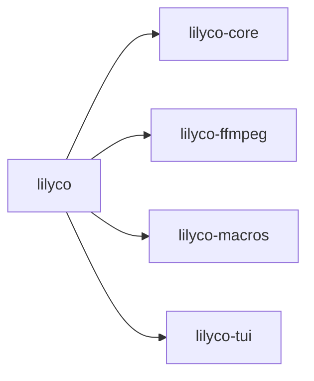

# lilyco · lilyco

> Sourcegraph CodeGraph 自动提取 · 观察即可,勿手改
> 再生成:`python tools/export-lilyco-graph.py`

## 概览

| 函数/方法 | 结构体 | 枚举/别名 | Trait | 路由 | 文件 |
|:--:|:--:|:--:|:--:|:--:|:--:|
| 20 | 1 | 2 | 0 | 0 | 1 |

## crate 依赖

## 公共符号 (public)

- 🧱 **`Env`** — 结构体 · `lib.rs:78`
- 🔠 **`Backend`** — 枚举 · `lib.rs:68`
- ⚙️ **`detect`** — 函数 · `lib.rs:125` `() -> Backend`
- ⚙️ **`detect_backend`** — 函数 · `lib.rs:95` `(env: &Env) -> Backend`
- ⚙️ **`run`** — 函数 · `lib.rs:136` `()`
- ⚙️ **`run_with`** — 函数 · `lib.rs:141` `(backend: Backend)`
- ⚙️ **`serve_mcp`** — 函数 · `lib.rs:158` `(registry: Registry)`

## 调用关系 (top)

- **`run_brush`** → `read_with_cap`(×2), `resolve_shell`(×1), `build_path_env`(×1), `emit`(×1), `new`(×1), `done`(×1)
- **`resolve_shell`** → `find_on_path`(×2)
- **`resolve_git_usr_bin`** → `iter`(×1)
- **`path_entries`** → `path_sep`(×1)
- **`build_path_env`** → `resolve_git_usr_bin`(×1), `path_entries`(×1)
- **`find_on_path`** → `path_entries`(×1), `path_exts`(×1)
- **`run`** → `as_str`(×5), `done`(×5), `emit`(×2), `init_project`(×2), `validate_project`(×2), `new_test`(×1)
- **`shell_available`** → `resolve_shell`(×1)
- **`echo_runs_and_captures_stdout`** → `shell_available`(×1), `run`(×1)
- **`exit_code_is_propagated_not_errored`** → `shell_available`(×1), `run`(×1)
- **`stderr_is_captured`** → `shell_available`(×1), `run`(×1)
- **`cwd_is_honored`** → `shell_available`(×1), `run`(×1)

## 文件清单

- `lilyco/src/lib.rs`

---
[[lilyco-knowledge|lilyco 知识图谱]] · [[lilyco-core-knowledge|← lilyco-core]] · [[lilyco-ffmpeg-knowledge|← lilyco-ffmpeg]] · [[lilyco-macros-knowledge|← lilyco-macros]] · [[lilyco-tui-knowledge|← lilyco-tui]]
