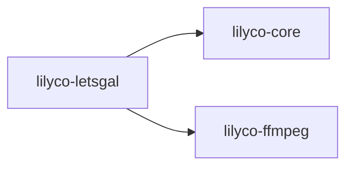

# lilyco · lilyco-letsgal

> Sourcegraph CodeGraph 自动提取 · 观察即可,勿手改
> 再生成:`python tools/export-lilyco-graph.py`

## 概览

| 函数/方法 | 结构体 | 枚举/别名 | Trait | 路由 | 文件 |
|:--:|:--:|:--:|:--:|:--:|:--:|
| 33 | 2 | 2 | 0 | 0 | 5 |

## crate 依赖

## 公共符号 (public)

- 🧱 **`Story`** — 结构体 · `dsl.rs:11`
- ⚙️ **`apply_character_flow`** — 函数 · `lib.rs:157` `(chapters: &mut [Value])`
- ⚙️ **`branch`** — 函数 · `lib.rs:148` `(branch_id: &str, options_json: Value) -> Value`
- ⚙️ **`call_fragment`** — 函数 · `lib.rs:137` `(fragment_id: &str) -> Value`
- ⚙️ **`camera`** — 函数 · `lib.rs:72` `(zoom: &str, dur: &str) -> Value`
- ⚙️ **`comment`** — 函数 · `lib.rs:124` `(text: &str) -> Value`
- ⚙️ **`curtain`** — 函数 · `lib.rs:49` `(op: &str, duration: &str) -> Value`
- ⚙️ **`dialogue`** — 函数 · `lib.rs:116` `(char_id: &str, char_name: &str, text: &str, expr: &str) -> Value`
- ⚙️ **`floating_text`** — 函数 · `lib.rs:128` `(text: &str, font_size: &str, dur: &str) -> Value`
- ⚙️ **`init_project`** — 函数 · `project.rs:8` `(dir: &Path, name: &str) -> Result<(), String>`
- ⚙️ **`narration`** — 函数 · `lib.rs:111` `(text: &str) -> Value`
- ⚙️ **`parse_story`** — 函数 · `dsl.rs:54` `(text: &str) -> Story`
- ⚙️ **`particle`** — 函数 · `lib.rs:65` `(mode: &str, preset: &str, texture_uri: &str) -> Value`
- ⚙️ **`register_asset`** — 函数 · `project.rs:107` `(dir: &Path, rel: &str) -> Result<Option<String>, String>`
- ⚙️ **`return_to_entry`** — 函数 · `lib.rs:152` `() -> Value`
- ⚙️ **`scene`** — 函数 · `lib.rs:53` `(scene_id: &str, scene_name: &str, uri: &str, td: &str) -> Value`
- ⚙️ **`show_title_ui`** — 函数 · `lib.rs:141` `() -> Value`
- ⚙️ **`sound`** — 函数 · `lib.rs:96` `(sound_type: &str, uri: &str, volume: &str, loop_flag: bool) -> Value`
- ⚙️ **`stable_id`** — 函数 · `lib.rs:16` `(namespace: &str, name: &str) -> String`
- ⚙️ **`stop_sound`** — 函数 · `lib.rs:103` `(sound_type: &str, fade: &str) -> Value`
- ⚙️ **`uid`** — 函数 · `lib.rs:29` `() -> String`
- ⚙️ **`upsert_character`** — 函数 · `project.rs:69` `(dir: &Path, name: &str) -> Result<String, String>`
- ⚙️ **`upsert_scene`** — 函数 · `project.rs:88` `(dir: &Path, name: &str) -> Result<String, String>`
- ⚙️ **`validate_project`** — 函数 · `project.rs:128` `(dir: &Path) -> Result<(Vec<String>, Vec<String>), String>`
- ⚙️ **`wait`** — 函数 · `lib.rs:107` `(ms: u64) -> Value`
- ⚙️ **`write_chapters`** — 函数 · `project.rs:39` `(dir: &Path, chapters: &[Value], name: Option<&str>) -> Result<(), String>`

## 调用关系 (top)

- **`run_brush`** → `read_with_cap`(×2), `resolve_shell`(×1), `build_path_env`(×1), `emit`(×1), `new`(×1), `done`(×1)
- **`resolve_shell`** → `find_on_path`(×2)
- **`resolve_git_usr_bin`** → `iter`(×1)
- **`path_entries`** → `path_sep`(×1)
- **`build_path_env`** → `resolve_git_usr_bin`(×1), `path_entries`(×1)
- **`find_on_path`** → `path_entries`(×1), `path_exts`(×1)
- **`run`** → `as_str`(×5), `done`(×5), `emit`(×2), `init_project`(×2), `validate_project`(×2), `new_test`(×1)
- **`shell_available`** → `resolve_shell`(×1)
- **`echo_runs_and_captures_stdout`** → `shell_available`(×1), `run`(×1)
- **`exit_code_is_propagated_not_errored`** → `shell_available`(×1), `run`(×1)
- **`stderr_is_captured`** → `shell_available`(×1), `run`(×1)
- **`cwd_is_honored`** → `shell_available`(×1), `run`(×1)

## 文件清单

- `lilyco-letsgal/src/dsl.rs`
- `lilyco-letsgal/src/lib.rs`
- `lilyco-letsgal/src/main.rs`
- `lilyco-letsgal/src/project.rs`
- `lilyco-letsgal/tests/integration.rs`

---
[[lilyco-letsgal-knowledge|lilyco-letsgal 知识图谱]] · [[lilyco-core-knowledge|← lilyco-core]] · [[lilyco-ffmpeg-knowledge|← lilyco-ffmpeg]]
