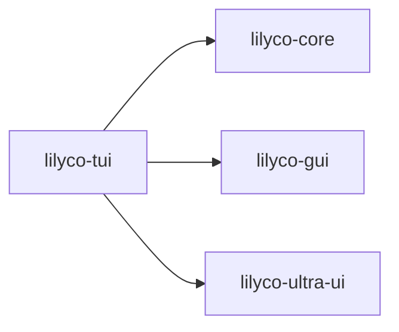

# lilyco · lilyco-tui

> Sourcegraph CodeGraph 自动提取 · 观察即可,勿手改
> 再生成:`python tools/export-lilyco-graph.py`

## 概览

| 函数/方法 | 结构体 | 枚举/别名 | Trait | 路由 | 文件 |
|:--:|:--:|:--:|:--:|:--:|:--:|
| 55 | 3 | 3 | 0 | 0 | 4 |

## crate 依赖

## 公共符号 (public)

- 🧱 **`FormField`** — 结构体 · `widgets.rs:73`
- 🧱 **`FormRenderer`** — 结构体 · `renderer.rs:14`
- 🧱 **`TuiApp`** — 结构体 · `app.rs:13`
- 🔠 **`AppState`** — 枚举 · `renderer.rs:41`
- 🔠 **`FieldValue`** — 枚举 · `widgets.rs:11`
- ⚙️ **`render_confirm`** — 函数 · `renderer.rs:216` `(fr: &FormRenderer, area: Rect, buf: &mut Buffer)`
- ⚙️ **`render_done`** — 函数 · `renderer.rs:306` `(fr: &FormRenderer, area: Rect, buf: &mut Buffer)`
- ⚙️ **`render_error`** — 函数 · `renderer.rs:324` `(fr: &FormRenderer, area: Rect, buf: &mut Buffer)`
- ⚙️ **`render_form`** — 函数 · `renderer.rs:139` `(fr: &FormRenderer, area: Rect, buf: &mut Buffer)`
- ⚙️ **`render_running`** — 函数 · `renderer.rs:256` `(fr: &FormRenderer, area: Rect, buf: &mut Buffer)`
- 🔧 **`all_required_filled`** — 方法 · `renderer.rs:107` `(&self) -> bool`
- 🔧 **`cancel`** — 方法 · `app.rs:221` `(&mut self)`
- 🔧 **`cli_preview`** — 方法 · `renderer.rs:93` `(&self) -> String`
- 🔧 **`error_progress`** — 方法 · `app.rs:215` `(&mut self, code: i32, message: String)`
- 🔧 **`fields`** — 方法 · `app.rs:41` `(&self) -> &[FormField]`
- 🔧 **`fields_mut`** — 方法 · `app.rs:37` `(&mut self) -> &mut Vec<FormField>`
- 🔧 **`finish_progress`** — 方法 · `app.rs:208` `(&mut self, result: serde_json::Value, duration_ms: u64)`
- 🔧 **`focused_field`** — 方法 · `renderer.rs:88` `(&self) -> Option<&FormField>`
- 🔧 **`focused_field_mut`** — 方法 · `renderer.rs:83` `(&mut self) -> Option<&mut FormField>`
- 🔧 **`from_schema`** — 方法 · `widgets.rs:28` `(arg: &ArgSchema) -> Self`
- 🔧 **`from_schema`** — 方法 · `widgets.rs:82` `(arg: &ArgSchema) -> Self`
- 🔧 **`handle_event`** — 方法 · `app.rs:48` `(&mut self, key: KeyEvent) -> bool`
- 🔧 **`handle_key`** — 方法 · `widgets.rs:162` `(&mut self, key: KeyEvent) -> bool`
- 🔧 **`log_progress`** — 方法 · `app.rs:203` `(&mut self, level: &str, message: String)`
- 🔧 **`new`** — 方法 · `app.rs:23` `(schema: &CommandSchema) -> Self`
- 🔧 **`new`** — 方法 · `renderer.rs:51` `(schema: &CommandSchema) -> Self`
- 🔧 **`next_field`** — 方法 · `renderer.rs:69` `(&mut self)`
- 🔧 **`prev_field`** — 方法 · `renderer.rs:76` `(&mut self)`
- 🔧 **`render`** — 方法 · `app.rs:58` `(&self, area: Rect, buf: &mut Buffer)`
- 🔧 **`render`** — 方法 · `widgets.rs:93` `(&self, area: Rect, buf: &mut Buffer, focused: bool)`
- 🔧 **`start_progress`** — 方法 · `app.rs:184` `(&mut self, _total: Option<u64>, message: Option<String>)`
- 🔧 **`state`** — 方法 · `app.rs:32` `(&self) -> &AppState`
- 🔧 **`tick_progress`** — 方法 · `app.rs:193` `(&mut self, current: u64, total: Option<u64>, message: Option<String>)`
- 🔧 **`to_cli_arg`** — 方法 · `widgets.rs:276` `(&self) -> Option<String>`

## 调用关系 (top)

- **`run_brush`** → `read_with_cap`(×2), `resolve_shell`(×1), `build_path_env`(×1), `emit`(×1), `new`(×1), `done`(×1)
- **`resolve_shell`** → `find_on_path`(×2)
- **`resolve_git_usr_bin`** → `iter`(×1)
- **`path_entries`** → `path_sep`(×1)
- **`build_path_env`** → `resolve_git_usr_bin`(×1), `path_entries`(×1)
- **`find_on_path`** → `path_entries`(×1), `path_exts`(×1)
- **`run`** → `as_str`(×5), `done`(×5), `emit`(×2), `init_project`(×2), `validate_project`(×2), `new_test`(×1)
- **`shell_available`** → `resolve_shell`(×1)
- **`echo_runs_and_captures_stdout`** → `shell_available`(×1), `run`(×1)
- **`exit_code_is_propagated_not_errored`** → `shell_available`(×1), `run`(×1)
- **`stderr_is_captured`** → `shell_available`(×1), `run`(×1)
- **`cwd_is_honored`** → `shell_available`(×1), `run`(×1)

## 文件清单

- `lilyco-tui/src/app.rs`
- `lilyco-tui/src/lib.rs`
- `lilyco-tui/src/renderer.rs`
- `lilyco-tui/src/widgets.rs`

---
[[lilyco-tui-knowledge|lilyco-tui 知识图谱]] · [[lilyco-knowledge|← lilyco]] · [[lilyco-core-knowledge|← lilyco-core]] · [[lilyco-gui-knowledge|← lilyco-gui]] · [[lilyco-ultra-ui-knowledge|← lilyco-ultra-ui]]
